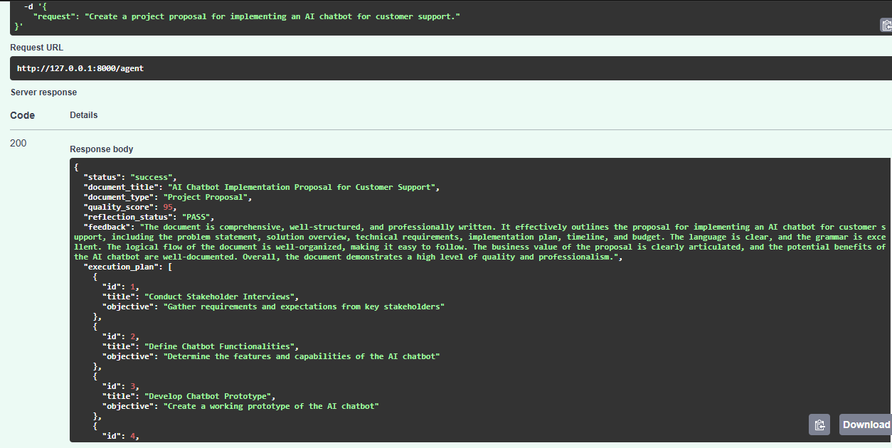

# 🚀 DocPilot AI - Autonomous Business Document Agent with LangGraph & Reflection-Based Decision Making.
> An autonomous AI agent that understands business requests, creates its own execution plan, generates professional Microsoft Word documents, performs quality review, and exposes everything through a FastAPI REST API.

---

# 📖 Project Overview

DocPilot AI is an autonomous AI agent built using **FastAPI**, **LangGraph**, **LangChain**, and **Groq LLM**.

Instead of generating a document in a single prompt, the system autonomously:

* Understands the user's request
* Creates its own execution plan
* Generates document sections independently
* Reviews the generated content
* Produces a professional Microsoft Word document
* Returns execution details through a REST API

This project demonstrates modern AI engineering concepts such as workflow orchestration, autonomous planning, structured outputs, and document generation.

---

# ❓ Problem Statement

Business users frequently create structured documents such as:

* Business Proposals
* Project Plans
* Strategy Documents
* SOPs
* Technical Designs
* Business Reports

Traditional LLM applications simply generate one long response and lack:

* Task planning
* Autonomous execution
* Self-review
* Structured workflows
* Professional document generation

The objective of this project is to build an autonomous AI agent capable of planning, executing, validating, and delivering business documents.

---

# 🎯 Objectives

* Build an autonomous AI agent using Python
* Accept natural language business requests
* Generate an execution/TODO plan
* Execute every task autonomously
* Make reasonable assumptions when information is missing
* Review generated content before finalizing
* Generate Microsoft Word (.docx) documents
* Expose functionality using FastAPI

---

# ✨ Key Features

* ✅ FastAPI REST API
* ✅ LangGraph workflow orchestration
* ✅ Groq Llama 3.3 70B integration
* ✅ Autonomous Planner Agent
* ✅ Section-wise content generation
* ✅ Reflection (Self Review) Agent
* ✅ Microsoft Word document generation
* ✅ Structured outputs using Pydantic
* ✅ Modular software architecture

---

# 🛠 Technology Stack

| Category              | Technology                     |
| --------------------- | ------------------------------ |
| Language              | Python 3.11                    |
| API                   | FastAPI                        |
| LLM                   | Groq (Llama-3.3-70B-Versatile) |
| Workflow              | LangGraph                      |
| Framework             | LangChain                      |
| Validation            | Pydantic                       |
| Document Generation   | python-docx                    |
| Environment Variables | python-dotenv                  |
| API Testing           | Swagger UI / Postman           |

---

# 🏗 Solution Architecture

```text
                         POST /agent
                              │
                              ▼
                        FastAPI API
                              │
                              ▼
                     LangGraph Workflow
                              │
                              ▼
                    Planner Agent
                              │
                              ▼
             Generate Execution Plan
                              │
                              ▼
                   Executor Agent
                              │
                              ▼
             Generate Document Sections
                              │
                              ▼
                  Reflection Agent
                              │
                Quality Evaluation
                        │
               ┌────────┴────────┐
               │                 │
            PASS               FAIL
               │                 │
               ▼                 ▼
       Generate DOCX      Retry Executor
               │                 │
               └────────┬────────┘
                        │
               (Maximum One Retry)
                        │
                        ▼
                Generate DOCX
                        │
                        ▼
                   Return Response
```

---

# ⚙ Workflow

```text
User Request
      │
      ▼
Planner Agent
      │
Creates TODO List
      │
      ▼
Executor Agent
      │
Generates Individual Sections
      │
      ▼
Reflection Agent
      │
Reviews Quality Score
      │
      ├──────── PASS ─────────┐
      │                       │
      ▼                       ▼
Generate DOCX           Retry Executor
      │                       │
      └──────────────┬────────┘
                     │
             Maximum One Retry
                     │
                     ▼
             Generate DOCX
                     │
                     ▼
             Return JSON Response
```

---

# 📂 Project Structure

```text
DocPilot-AI
│
├── app
│   ├── agents
│   │   ├── planner.py
│   │   ├── executor.py
│   │   └── reflector.py
│   │
│   ├── api
│   │   └── routes.py
│   │
│   ├── graph
│   │   ├── workflow.py
│   │   └── state.py
│   │
│   ├── models
│   │
│   ├── prompts
│   │
│   ├── services
│   │
│   ├── outputs
│   │
│   └── main.py
│
├── requirements.txt
├── README.md
└── .env
```

---

# 🤖 Autonomous Planning

Unlike a traditional chatbot, DocPilot AI does not immediately generate the final document.

Instead, it first analyzes the user's request and creates its own execution plan before taking action.

Example Execution Plan:

```text
Task 1 → Understand User Request

Task 2 → Identify Document Type

Task 3 → Make Business Assumptions

Task 4 → Create Document Structure

Task 5 → Generate Individual Sections

Task 6 → Review Document Quality

Task 7 → Decide Whether to Retry

Task 8 → Generate Microsoft Word Document
```

---

# 🔍 Engineering Improvement

## Reflection + Retry with Conditional Routing

The implemented engineering improvement combines **Reflection**, **Retry Logic**, and **LangGraph Conditional Routing**.

After generating the document, the Reflection Agent evaluates:

- Document completeness
- Professional writing style
- Grammar
- Logical flow
- Business value

The Reflection Agent assigns a quality score (0–100).

Instead of relying on the LLM to determine the outcome, the application evaluates the quality score using Python business rules:

- Quality Score ≥ 85 → PASS
- Quality Score < 85 → FAIL

If the document fails the quality threshold, LangGraph automatically routes the workflow back to the Executor Agent for one additional improvement cycle using the reviewer's feedback.

To prevent infinite execution loops, the workflow allows only one retry before generating the final document.

---

# 🏛 Architecture Decisions

| Decision | Reason |
|----------|--------|
| LangGraph | Used for workflow orchestration and conditional routing |
| Groq Llama 3.3 70B | High-performance free LLM with fast inference |
| Pydantic Structured Output | Ensures strongly typed planner and reflection responses |
| Reflection Agent | Improves document quality through self-review |
| Conditional Edge | Enables autonomous decision-making based on quality score |
| Python Business Rules | Keeps PASS/FAIL logic deterministic instead of relying on LLM output |
| Modular Agents | Planner, Executor, Reflection, and DOCX generation are independently maintainable |

---

# 🌐 API Endpoint

## POST /agent

### Request

```json
{
    "request": "Create an executive AI adoption playbook for a mid-sized property management company."
}
```

---

### Sample Response

```json
{
    "status": "success",
    "document_title": "Executive AI Adoption Playbook",
    "document_type": "Business Strategy",
    "quality_score": 95,
    "reflection_status": "PASS",
    "feedback": "Document is complete and professionally written.",
    "output_file": "app/outputs/Executive_AI_Adoption_Playbook.docx"
}
```

---

# 🚀 Installation

Clone the repository


Navigate to the project

```bash
cd DocPilot-AI
```

Create virtual environment

```bash
python -m venv .venv
```

Activate virtual environment

### Windows

```bash
.venv\Scripts\activate
```

Install dependencies

```bash
pip install -r requirements.txt
```

Create `.env`

```text
GROQ_API_KEY=YOUR_GROQ_API_KEY
MODEL_NAME=llama-3.3-70b-versatile
```

---

# ▶ Running the Application

```bash
uvicorn app.main:app --reload
```

Swagger UI

```text
http://127.0.0.1:8000/docs
```

---

# 🧪 Test Cases

## Test Case 1 – Standard Business Request

```text
Create an executive AI Adoption Playbook for a mid-sized property management company that wants to introduce Generative AI across leasing, maintenance, accounting, and customer support.

Include executive summary, current challenges, AI use cases by department, implementation roadmap, governance guidelines, risk assessment, employee training strategy, and success metrics.

Assume reasonable business details wherever information is missing.
```

---

## Test Case 2 – Complex Autonomous Planning

```text
A real estate company has started a digital transformation program but the project is behind schedule.

The CFO wants to minimize cost.

The COO wants deployment within three months.

The IT team recommends six months because of technical debt.

Operations cannot tolerate more than two days of business disruption.

Create a strategic recovery plan balancing these conflicting priorities.

Make reasonable assumptions where information is missing and include stakeholder analysis, implementation roadmap, decision matrix, risk mitigation plan, executive summary, and recommendations.
```

---

# 📸 Screenshots

## POST Request

> **
> 
> **

> **
---

## Generated DOCX

> **

> **
---

# 🎯 Conclusion

DocPilot AI demonstrates how autonomous AI agents can move beyond simple prompt-response interactions by planning, executing, reviewing, and generating professional business documents through a structured workflow.

The project combines **FastAPI**, **LangGraph**, **LangChain**, **Groq**, and **Pydantic** to implement an end-to-end autonomous document generation system with modular architecture, structured outputs, reflection-based quality assurance, and Microsoft Word document generation.

This solution showcases practical AI engineering principles including workflow orchestration, task planning, reasoning, software architecture, API development, and autonomous decision-making.
